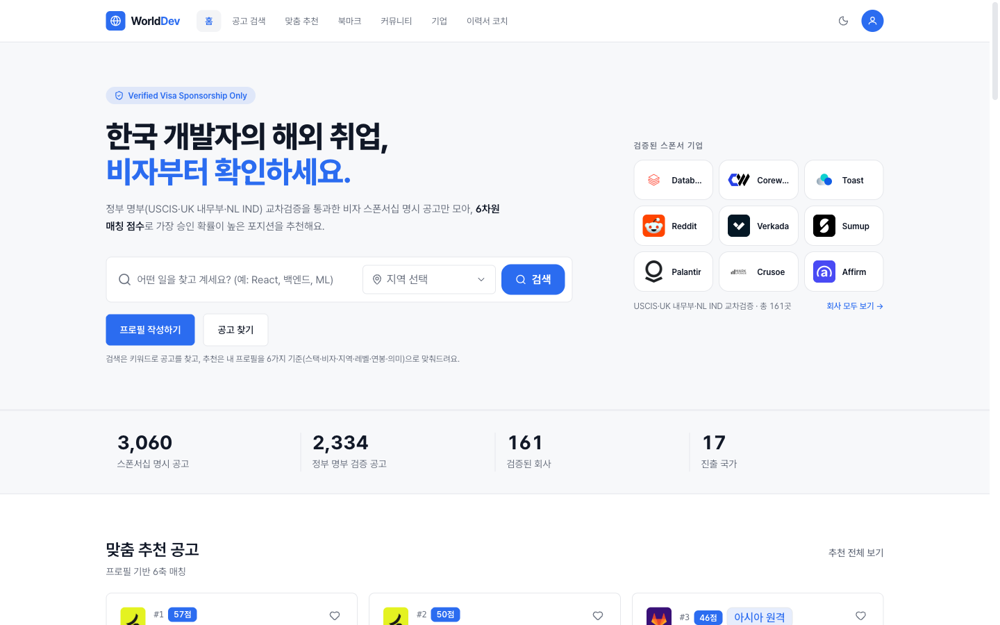
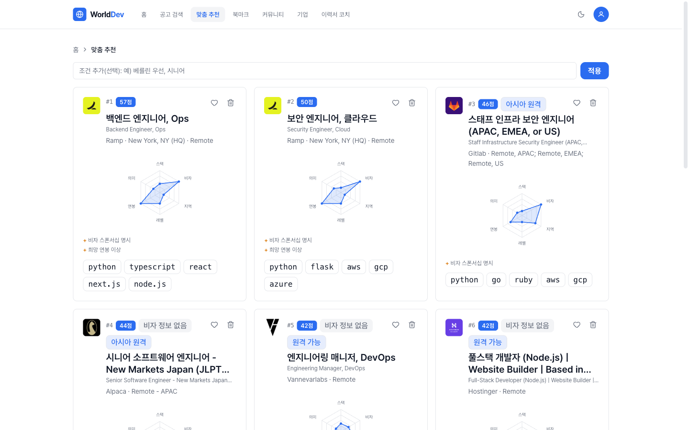
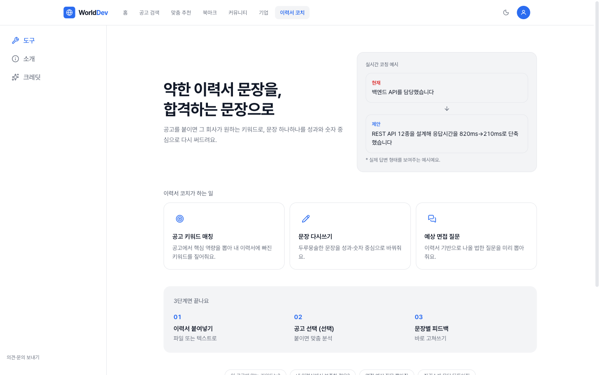
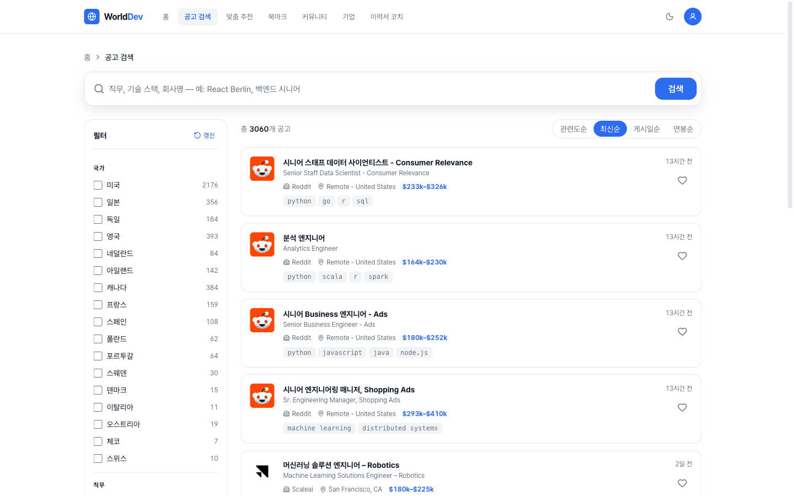
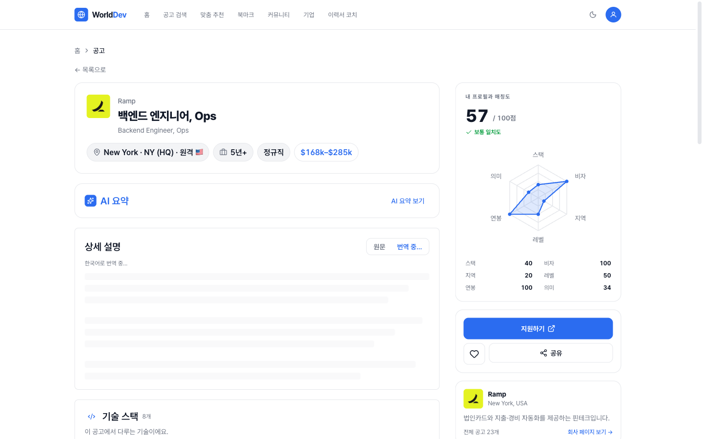

# WorldDeveloper

> 비자 스폰서십이 **검증된** 해외 개발자 채용 공고만 모아, 프로필 기반 6축 매칭과 AI 이력서 코칭으로 한국 개발자의 해외 취업을 돕는 풀스택 서비스.

**Live:** https://152.67.215.221.sslip.io · Next.js + Spring Boot + FastAPI 폴리글랏 모노레포 · OCI 단일 VM에 Docker Compose 배포(GitHub Actions CD).



---

## 무엇을, 왜

해외 취업을 노리는 개발자에게 1순위 필터는 "이 회사가 비자를 스폰서해 주는가"다. 대부분의 채용 보드는 이를 알려주지 않아, 지원자는 스폰서 여부도 모른 채 수십 곳에 헛지원한다.

WorldDeveloper는 이 지점을 공략한다:

- **정부 명부 교차검증** — 미국 USCIS, 영국 Home Office, 네덜란드 IND 등 공식 비자 스폰서 명부와 기업명을 대조해 "비자 스폰서십 명시" 공고만 신뢰 등급으로 분류한다. 모호하면 추측하지 않고 `unclear`로 표기한다.
- **6축 매칭** — 스택·비자·지역·레벨·연봉·의미(임베딩) 6개 축으로 프로필과 공고의 적합도를 점수화하고, 각 점수의 근거를 투명하게 공개한다.
- **AI 이력서 코치** — 공고를 첨부하면 그 회사가 원하는 키워드 기준으로 이력서 문장을 `현재 → 제안` 형태로 다시 써 준다(LLM, 토큰 스트리밍).

매일 자정(KST) ETL이 잡보드 + 7종 ATS(Greenhouse, Lever, Ashby, Workable, SmartRecruiters, HRMOS, Personio)에서 공고를 수집·정규화·임베딩해 약 6천 건의 라이브 공고를 유지한다.

---

## 아키텍처

```
                         Caddy (자동 HTTPS · 리버스 프록시)
                                     │
             ┌───────────────────────┼───────────────────────┐
             ▼                       ▼                        ▼
       web (Next.js)          backend (Spring Boot)      ai (FastAPI)
       App Router / SSR ─────▶  REST API · 인증/OAuth ──▶  임베딩 추론
       BFF 프록시 라우트         JPA · JWT 세션              OpenAI 코치/요약
                                     │                        │
                                     ▼                        ▼
                             Postgres + pgvector          etl-worker
                             (벡터검색 + 관계형)          (수집 스케줄러, 별도 프로세스)
                                     ▲
                       Redis (opt-in, 멀티 인스턴스 시)   LibreTranslate (셀프호스팅 번역)
```

세 서비스를 책임으로 분리했다.

| 서비스 | 스택 | 책임 |
|---|---|---|
| **web** | Next.js 14 (App Router), TypeScript, Tailwind | SSR UI + 서버 라우트가 세션·시크릿을 쥐고 백엔드를 프록시(BFF). 클라이언트엔 토큰 비노출 |
| **backend** | Spring Boot 3, Java 17, JPA, Spring Security | 인증(이메일+OAuth), 공고/추천/코치/커뮤니티 API, 6축 스코어링, 분석 |
| **ai** | FastAPI, Python 3.12, sentence-transformers | 임베딩 추론(`paraphrase-multilingual-MiniLM`, 384d), OpenAI 요약/코치 프록시 |
| **etl-worker** | 위 ai 이미지 재사용 | 수집 스케줄러를 웹 서비스와 분리 — 수집 중에도 API 응답이 멈추지 않게 함 |

데이터는 Postgres + **pgvector** 하나로 통합 — 관계형 데이터와 임베딩 벡터(코사인 유사도 검색)를 같은 DB에서 처리한다.

---

## 기술적으로 고민한 지점

- **폴리글랏 분리** — AI/임베딩은 Python 생태계가, 트랜잭션·인증은 Spring이, SSR·UX는 Next가 강하다. 각자 강한 곳을 맡기고 내부 HTTP로 묶었다.
- **수집과 서빙의 프로세스 분리** — ETL은 처음 인프로세스 스케줄러였는데, 수집(약 20분, CPU 집약)이 이벤트 루프를 잡아 코치/추천 응답이 멈췄다. 같은 이미지를 `etl-worker`로 따로 띄워 격리.
- **임베딩 콜드스타트** — 컨테이너 재시작 후 첫 추론이 느려 매칭 점수 요청이 타임아웃 났다. 기동 시 더미 1회 추론으로 모델을 워밍업해 첫 요청부터 정상 동작.
- **검증 가능한 신뢰** — "비자 스폰서"를 추측하면 사용자를 잘못된 지원으로 보낸다. 정부 명부 대조 + 공고 원문 분류로 등급을 매기고, 모호하면 단정하지 않는다.
- **복잡도를 더하지 않는 판단** — 단일 인스턴스로 충분한 트래픽 단계라 레이트리밋은 인메모리로 두고, Redis는 멀티 인스턴스로 확장할 때 켤 수 있도록 스캐폴딩만 해뒀다(불필요한 인프라 회피).
- **비용 통제** — 번역은 셀프호스팅 LibreTranslate(API 비용 0), LLM 요약은 공고당 1회 호출 후 DB 캐시, LLM 재분류는 옵트인.
- **BFF 패턴** — 세션 JWT와 내부 시크릿은 Next 서버 라우트에만 두고, 백엔드(8080)는 호스트에 노출하지 않는다(Docker 네트워크 내부 전용).

---

## 엔지니어링 하이라이트

**테스트 & CI** — web `vitest` 52파일 · backend JUnit 41파일 · ai/MCP `pytest` 51파일(364 케이스). GitHub Actions가 변경된 레이어만 골라 검증한다(web: 타입체크 + 테스트 + 빌드 / backend: gradle test / ai: pytest + import). 모든 변경은 PR + CI 통과 후 머지.

**보안 (defense-in-depth)**
- 이메일/비밀번호 재설정 코드 시도 횟수 잠금 — 6자리 코드 브루트포스 차단
- 운영 시크릿 fail-fast — JWT/내부/DB 시크릿이 dev 기본값이면 부팅 거부
- 내부(`/internal`) AI 엔드포인트 토큰 인증(opt-in) — 유료 LLM 경로 무단 호출 차단
- BFF 경로 주입 방어(`encodeURIComponent`) · 오픈 리다이렉트(`callbackUrl`) 검증 · 저장형 XSS(`sourceUrl` 스킴 화이트리스트) · MCP RSS feed SSRF 가드
- 비용/남용 경로(로그인·추천·요약 등) 레이트리밋

**성능**
- 임베딩 **배치 인코딩** — 공고/이력서 구절마다 개별 `model.encode` 대신 1회 배치 처리
- ETL **배치 upsert** — `executemany` + 행별 savepoint 폴백(행 격리를 유지하면서 happy-path 가속)
- 레퍼런스 데이터(지역·회사 목록) ISR 캐시 + 백엔드→Next JSON gzip

**데이터 파이프라인** — 12개 소스(7 ATS + 잡보드)에서 수집 → 회사명/스택/연봉/시니어리티/원격 정규화 → 비자 분류(키워드 + 정부 명부 교차검증 + LLM 폴백) → 임베딩 → pgvector 적재. dead-end(한국에서 지원 불가한 지역제한 원격 등) 공고는 적재 단계에서 제거.

---

## 주요 기능

- **공고 검색·필터** — 지역(국가)·기술 스택·비자 등급 필터, Postgres 전문 검색(tsvector)
- **맞춤 추천** — 프로필 6축 매칭 + pgvector 의미 검색, 점수 근거 공개, 다양성 제약(회사 편중 방지)
- **AI 이력서 코치** — 공고 grounding 기반 문장 리라이트, PDF 이력서 업로드 추출, 토큰 스트리밍
- **인기 TOP 공고** — 조회 로그 기반 지역·직무별 인기 공고(데이터 희소 시 최신순 fallback)
- **인증** — 이메일(6자리 코드 인증) + GitHub/Google OAuth, JWT 세션
- **지원 관리** — 북마크, 칸반 지원 트래커(키보드 접근성 지원), 커뮤니티, 회사 디렉터리
- **분석** — 조회/가입/재방문 퍼널(운영자 대시보드), 고유 열람자 기준 중복 제거

### 화면

| 맞춤 추천 (6축 레이더) | AI 이력서 코치 |
|---|---|
|  |  |

| 공고 검색·필터 | 공고 상세 (매칭도·AI 요약) |
|---|---|
|  |  |

---

## 모노레포 구조

```
WorldDeveloper/
├── web/        Next.js 14 (App Router, TypeScript) — UI + BFF
├── backend/    Spring Boot 3 (Java 17) — REST API · 인증 · 스코어링 · Flyway 마이그레이션
├── ai/         FastAPI (Python 3.12) — 임베딩 · ETL worker · LLM 프록시
│   └── dev_jobs_core/   수집·정규화·추천 코어 라이브러리
├── deploy/     docker-compose.prod.yml · Caddyfile · update.sh · CD
├── dev-jobs-mcp/  채용 공고 MCP 서버 (독립 패키지)
└── docs/       설계 문서
```

규모: Java 130파일 · TS/TSX 284파일 · Python 95파일 · DB 마이그레이션 29개(Flyway) · 테스트 web 52 / backend 41 / ai 51 파일.

---

## 로컬 개발

요구사항: Node 20+ / Python 3.12+ (uv) / JDK 17+ / Docker

```bash
# 1. Postgres(pgvector) 띄우기
docker compose up -d postgres

# 2. Backend (Spring) → http://localhost:8080/api/v1/health
cd backend && ./gradlew bootRun

# 3. AI (FastAPI) → http://localhost:8001/internal/health
cd ai && uv sync && uv run uvicorn app.main:app --reload --port 8001

# 4. Web (Next.js) → http://localhost:3000
cd web && npm install && npm run dev
```

또는 `./dev.sh` 하나로 DB + 메일(Mailhog) + AI + 백엔드 + 프론트를 한 번에 띄운다.

테스트:

```bash
cd web && npm test           # vitest
cd backend && ./gradlew test
cd ai && uv run pytest
```

---

## 배포

OCI ARM 단일 VM에 Docker Compose로 전체 스택을 올린다(`deploy/docker-compose.prod.yml`). Caddy가 자동 HTTPS(Let's Encrypt)와 리버스 프록시를 담당한다.

**CD:** `main`에 머지 → GitHub Actions CI 통과 → `Deploy` 워크플로가 서버로 rsync 후 `docker compose up -d --build`. 수동 배포는 `./deploy/update.sh`.

---

설계 상세는 [`DESIGN.md`](./DESIGN.md), 매칭·코치 파이프라인은 [`docs/matching-and-coach-pipeline.md`](./docs/matching-and-coach-pipeline.md) 참고.
